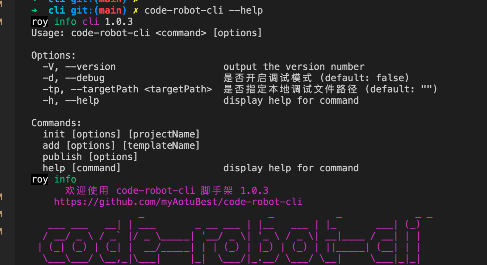

<h1 align="center">Welcome to code-robot-cli 👋</h1>
<p>
  <a href="https://www.npmjs.com/package/code-robot-cli" target="_blank">
    
  </a>
  <a href="https://github.com/myAotuBest/code-robot-cli/blob/main/README.md" target="_blank">
    
  </a>
  <a href="https://github.com/myAotuBest" target="_blank">
    
  </a>
</p>

> 高性能脚手架、包含 gitflow、自建 ci、cd 全流程

### 🏠 [Homepage](https://github.com/myAotuBest)

### ✨ [Demo](https://github.com/myAotuBest/code-robot-cli)

## Install

```sh
npm install @code-robot-cli/core
```

## Usage

```sh
code-robot-cli
```



## Architecture Design


## CI、CD


## 模版页面复用


## 代码片段模版复用


## Gitflow


more see https://www.yuque.com/dandanaotuman/odex3n/cg7qrx 😄

## Author

👤 **xikun**

- Website: https://lilixikun.github.io/
- Github: [@lilixikun](https://github.com/lilixikun)

## 🤝 Contributing

Contributions, issues and feature requests are welcome!<br />Feel free to check [issues page](https://github.com/myAotuBest/code-robot-cli/issues). You can also take a look at the [contributing guide](https://github.com/myAotuBest/code-robot-cli/graphs/contributors).

## Show your support

Give a ⭐️ if this project helped you!

## 📝 License

Copyright © 2022 [xikun](https://github.com/lilixikun).<br />
This project is [ISC](https://github.com/myAotuBest) licensed.

---

_This README was generated with ❤️ by [readme-md-generator](https://github.com/kefranabg/readme-md-generator)_
